# Hermes Agent Java - 完整架构图

> 本文档包含系统的整体架构、租户隔离机制和关键业务流程的完整可视化

---

## 一、整体系统架构图

```mermaid
graph TB
    subgraph "External Layer"
        Users[用户/客户端]
        Platforms[消息平台<br/>Discord/Telegram/Feishu/QQ]
        ExternalAPIs[外部API<br/>OpenAI/Anthropic/Brave]
    end

    subgraph "Gateway Layer"
        Gateway[GatewayServer<br/>HTTP WebSocket服务]
        AuthFilter[TenantAuthFilter<br/>租户认证过滤器]
        RateLimiter[API Rate Limiter<br/>租户级限流]
    end

    subgraph "Core Engine"
        Agent[HermesAgentV2<br/>核心Agent引擎]
        ModelClient[ModelClient<br/>模型客户端]
        Transport[TransportFactory<br/>传输层适配]
        
        subgraph "Transport Adapters"
            Anthropic[AnthropicTransport]
            Bedrock[BedrockTransport]
            ChatGPT[ChatCompletionsTransport]
            Codex[CodexTransport]
        end
    end

    subgraph "Tool System"
        ToolRegistry[ToolRegistry<br/>工具注册中心]
        ToolInit[ToolInitializerV2<br/>工具初始化器]
        
        subgraph "Built-in Tools"
            FileTool[FileTool<br/>文件操作]
            CodeTool[CodeTool<br/>代码执行]
            Browser[BrowserToolV2<br/>浏览器控制]
            WebSearch[WebSearchToolV2<br/>网络搜索]
            Terminal[TerminalTool<br/>终端执行]
            GitTool[GitTool<br/>版本控制]
            MCPTool[MCPTool<br/>MCP协议]
            SubAgent[SubAgentTool<br/>子Agent]
        end
        
        subgraph "Platform Tools"
            Feishu[FeishuDocTool<br/>飞书文档]
            Discord[DiscordTool<br/>Discord]
            QQBot[QQBotAdapter<br/>QQ机器人]
        end
    end

    subgraph "Multi-Tenant System"
        TenantMgr[TenantManager<br/>租户管理器]
        TenantCtx[TenantContext<br/>租户上下文]
        
        subgraph "Tenant Isolation"
            FileSandbox[TenantFileSandbox<br/>文件沙箱]
            ProcessSandbox[ProcessSandbox<br/>进程沙箱]
            NetworkSandbox[NetworkSandbox<br/>网络沙箱]
            StorageQuota[StorageQuotaEnforcer<br/>存储配额]
            ThreadPool[TenantThreadPool<br/>线程池隔离]
        end
        
        subgraph "Tenant Management"
            Config[TenantConfig<br/>租户配置]
            Quota[TenantQuota<br/>资源配额]
            Security[TenantSecurityPolicy<br/>安全策略]
            Audit[TenantAuditLogger<br/>审计日志]
            SessionMgr[TenantSessionManager<br/>会话管理]
            MemoryMgr[TenantMemoryManager<br/>内存管理]
        end
    end

    subgraph "Storage Layer"
        LocalFS[本地文件系统<br/>sandbox/{tenantId}/]
        GitRepos[Git仓库]
        MCPServers[MCP Servers]
    end

    %% Connections
    Users -->|HTTP/WebSocket| Gateway
    Platforms -->|Webhook| Gateway
    
    Gateway --> AuthFilter
    AuthFilter --> RateLimiter
    RateLimiter --> Agent
    
    Agent --> ModelClient
    ModelClient --> Transport
    Transport --> Anthropic & Bedrock & ChatGPT & Codex
    Transport --> ExternalAPIs
    
    Agent --> ToolRegistry
    ToolRegistry --> ToolInit
    ToolInit --> FileTool & CodeTool & Browser & WebSearch & Terminal & GitTool & MCPTool & SubAgent
    ToolInit --> Feishu & Discord & QQBot
    
    Agent --> TenantMgr
    TenantMgr --> TenantCtx
    TenantCtx --> FileSandbox & ProcessSandbox & NetworkSandbox & StorageQuota & ThreadPool
    TenantCtx --> Config & Quota & Security & Audit & SessionMgr & MemoryMgr
    
    FileSandbox --> LocalFS
    ProcessSandbox --> LocalFS
    Terminal --> LocalFS
    GitTool --> GitRepos
    MCPTool --> MCPServers
```

---

## 二、租户隔离架构图

### 2.1 多层隔离模型

```mermaid
graph TB
    subgraph "Physical Layer"
        JVM[JVM进程]
        OS[操作系统]
        Hardware[硬件资源]
    end

    subgraph "Tenant Isolation Layer"
        direction TB
        
        subgraph "Tenant A"
            TA_Config[独立配置]
            TA_FS[文件沙箱<br/>/sandbox/tenant-a/]
            TA_Process[进程沙箱<br/>资源限制]
            TA_Network[网络沙箱<br/>白名单控制]
            TA_Thread[线程池<br/>10 threads max]
            TA_Storage[存储配额<br/>1GB limit]
            TA_Memory[内存隔离<br/>256MB limit]
        end
        
        subgraph "Tenant B"
            TB_Config[独立配置]
            TB_FS[文件沙箱<br/>/sandbox/tenant-b/]
            TB_Process[进程沙箱<br/>资源限制]
            TB_Network[网络沙箱<br/>白名单控制]
            TB_Thread[线程池<br/>10 threads max]
            TB_Storage[存储配额<br/>1GB limit]
            TB_Memory[内存隔离<br/>256MB limit]
        end
        
        subgraph "Tenant C"
            TC_Config[独立配置]
            TC_FS[文件沙箱<br/>/sandbox/tenant-c/]
            TC_Process[进程沙箱<br/>资源限制]
            TC_Network[网络沙箱<br/>白名单控制]
            TC_Thread[线程池<br/>10 threads max]
            TC_Storage[存储配额<br/>1GB limit]
            TC_Memory[内存隔离<br/>256MB limit]
        end
    end

    subgraph "Shared Resources"
        Shared_Model[模型客户端<br/>共享连接池]
        Shared_Tool[工具注册表<br/>只读共享]
        Shared_Platform[平台适配器<br/>多路复用]
    end

    %% Isolation boundaries
    TA_FS -.->|完全隔离| TB_FS
    TA_FS -.->|完全隔离| TC_FS
    TA_Process -.->|cgroups隔离| TB_Process
    TA_Network -.->|独立策略| TB_Network
    
    %% Resource usage
    TenantA -->|使用| TA_FS & TA_Process & TA_Network & TA_Thread & TA_Storage & TA_Memory
    TenantB -->|使用| TB_FS & TB_Process & TB_Network & TB_Thread & TB_Storage & TB_Memory
    TenantC -->|使用| TC_FS & TC_Process & TC_Network & TC_Thread & TC_Storage & TC_Memory
    
    %% Shared access
    TenantA & TenantB & TenantC -->|共享访问| Shared_Model & Shared_Tool & Shared_Platform
```

### 2.2 资源沙箱详细架构

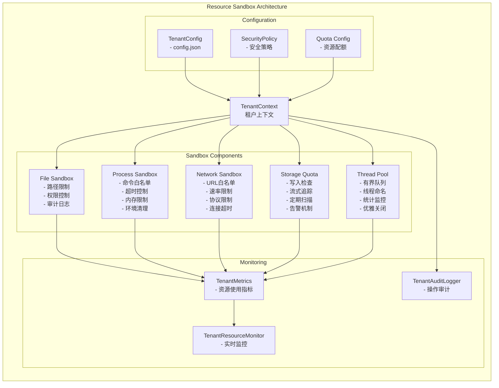

---

## 三、关键逻辑链路时序图

### 3.1 租户创建流程

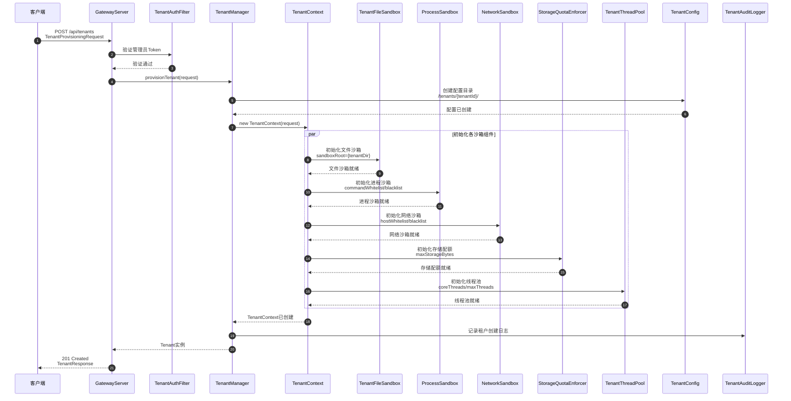

### 3.2 工具执行流程（带资源限制）

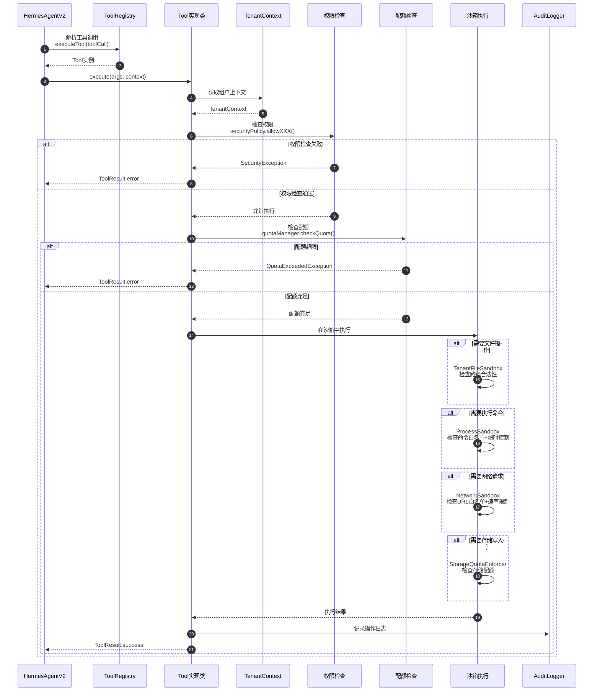

### 3.3 进程沙箱执行流程

```mermaid
sequenceDiagram
    autonumber
    participant Caller as 调用方
    participant ProcessSB as ProcessSandbox
    participant Config as ProcessSandboxConfig
    participant Validator as 命令验证器
    participant Timeout as Timeout包装器
    subprocess Linux系统
        participant Process as ProcessBuilder
        participant cgroups as Linux cgroups
        participant Signal as SIGTERM信号
    end
    participant Result as ProcessResult

    Caller->>ProcessSB: exec(command, options)
    
    ProcessSB->>Config: 获取配置
    Config-->>ProcessSB: whitelist/blacklist<br/>workDirectory
    
    ProcessSB->>Validator: 验证命令
    Validator->>Validator: 提取命令名称
    Validator->>Validator: 检查黑名单
    
    alt 命中黑名单
        Validator-->>ProcessSB: 拒绝执行
        ProcessSB-->>Caller: ProcessSandboxException
    else 通过黑名单检查
        Validator->>Validator: 检查白名单
        
        alt 白名单非空且未命中
            Validator-->>ProcessSB: 拒绝执行
            ProcessSB-->>Caller: ProcessSandboxException
        else 通过白名单检查
            Validator-->>ProcessSB: 命令验证通过
            
            ProcessSB->>Timeout: 包装超时控制
            
            alt Linux系统且设置了超时
                Timeout->>Timeout: 添加timeout命令<br/>timeout -s SIGTERM {seconds}
            end
            
            Timeout->>Process: 创建进程
            Process->>Process: 设置工作目录
            Process->>Process: 清理环境变量
            
            alt Linux且有cgroups配置
                Process->>cgroups: 写入cgroup限制<br/>memory/cpu限制
            end
            
            Process->>Process: 启动进程
            
            alt 设置了超时
                Process->>Signal: 超时后发送SIGTERM
                Signal->>Process: 终止进程
            end
            
            Process-->>Timeout: 进程结束
            Timeout-->>ProcessSB: 返回结果
            
            ProcessSB->>Result: 封装结果
            Result-->>ProcessSB: ProcessResult
            ProcessSB-->>Caller: 返回结果
        end
    end
```

### 3.4 网络沙箱请求流程

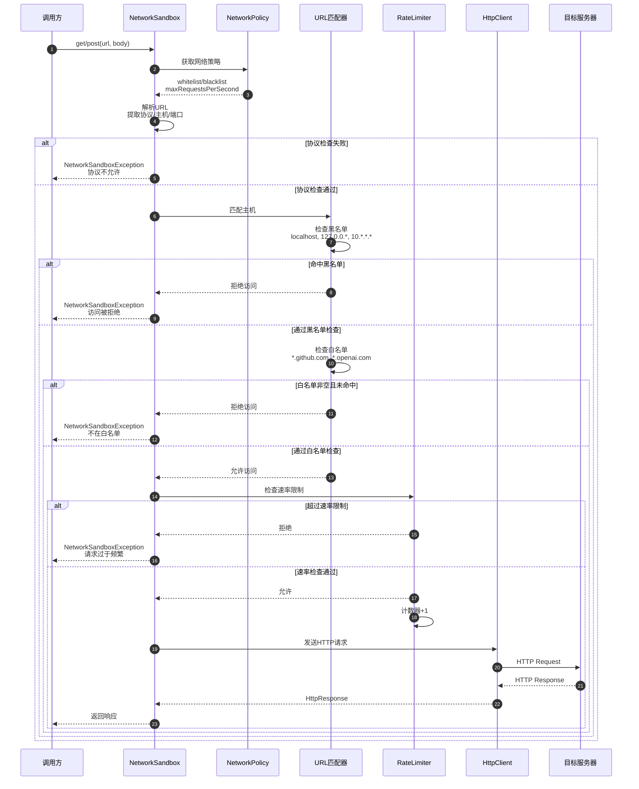

### 3.5 存储配额检查流程

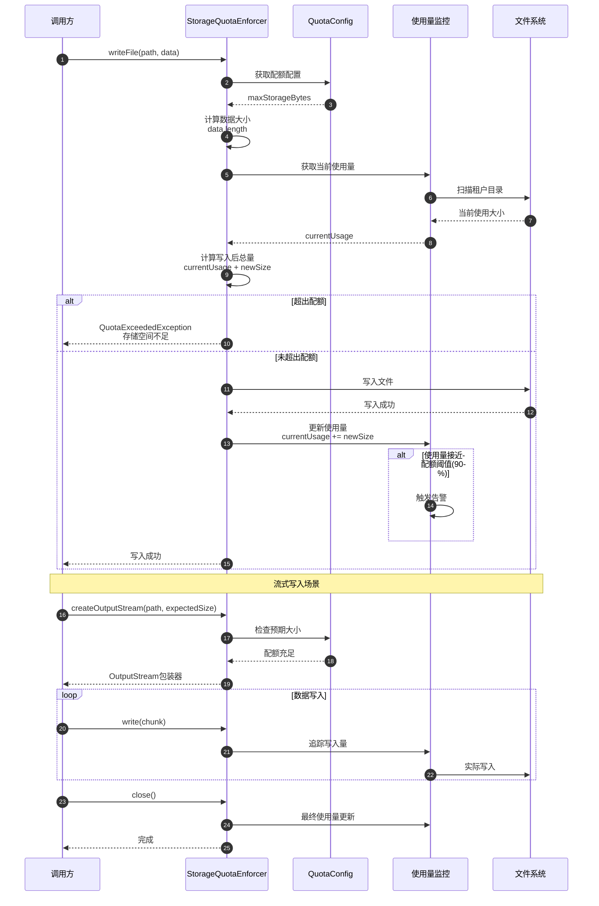

---

## 四、组件关系图

### 4.1 工具系统与租户隔离的集成

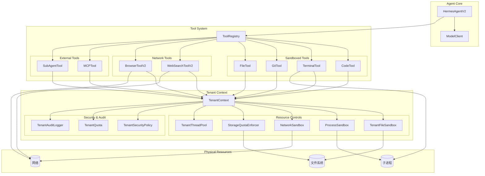

### 4.2 配置继承与覆盖关系

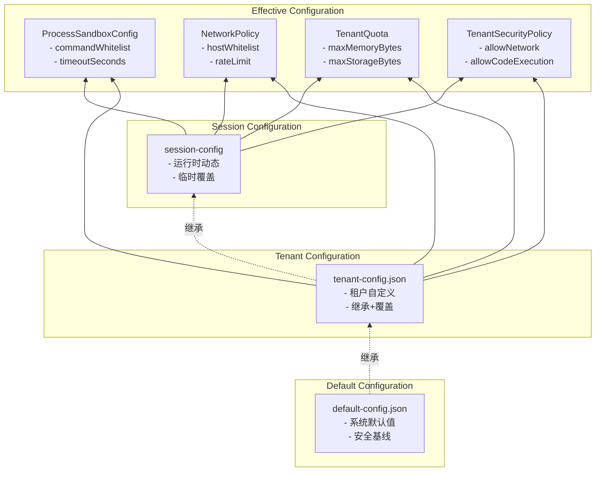

---

## 五、部署架构图

```mermaid
graph TB
    subgraph "Client Layer"
        WebUI[Web UI]
        CLI[CLI Client]
        Mobile[Mobile App]
    end

    subgraph "Load Balancer"
        LB[Nginx/ALB
        - SSL终止
        - 负载均衡
        - 静态资源缓存]
    end

    subgraph "Hermes Agent Cluster"
        Node1[Hermes Node 1
        - GatewayServer
        - TenantManager
        - Agent Engine]
        
        Node2[Hermes Node 2
        - GatewayServer
        - TenantManager
        - Agent Engine]
        
        Node3[Hermes Node 3
        - GatewayServer
        - TenantManager
        - Agent Engine]
    end

    subgraph "Shared Storage"
        NFS[NFS/EFS
        - 租户文件持久化
        - /sandbox/{tenantId}/]
        
        Redis[Redis Cluster
        - 会话缓存
        - 速率限制计数]
        
        DB[(PostgreSQL
        - 租户元数据
        - 审计日志)]
    end

    subgraph "External Services"
        OpenAI[OpenAI API]
        Anthropic[Anthropic API]
        Search[Search APIs
        - Brave/Tavily]
        MCP[MCP Servers]
    end

    subgraph "Monitoring"
        Prometheus[Prometheus
        - 指标采集]
        Grafana[Grafana
        - 可视化面板]
        ELK[ELK Stack
        - 日志分析]
    end

    WebUI & CLI & Mobile --> LB
    LB --> Node1 & Node2 & Node3
    
    Node1 & Node2 & Node3 --> NFS
    Node1 & Node2 & Node3 --> Redis
    Node1 & Node2 & Node3 --> DB
    
    Node1 & Node2 & Node3 --> OpenAI & Anthropic & Search & MCP
    
    Node1 & Node2 & Node3 --> Prometheus
    Prometheus --> Grafana
    Node1 & Node2 & Node3 --> ELK
```

---

## 六、数据流图

### 6.1 请求处理数据流

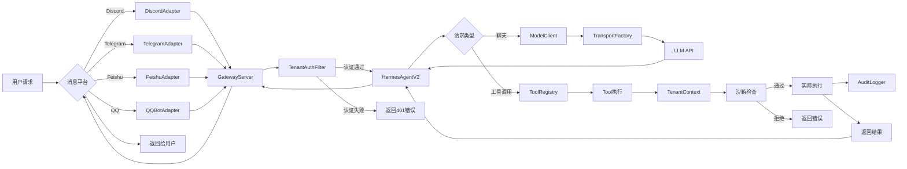

---

## 七、类图

### 7.1 核心类关系图

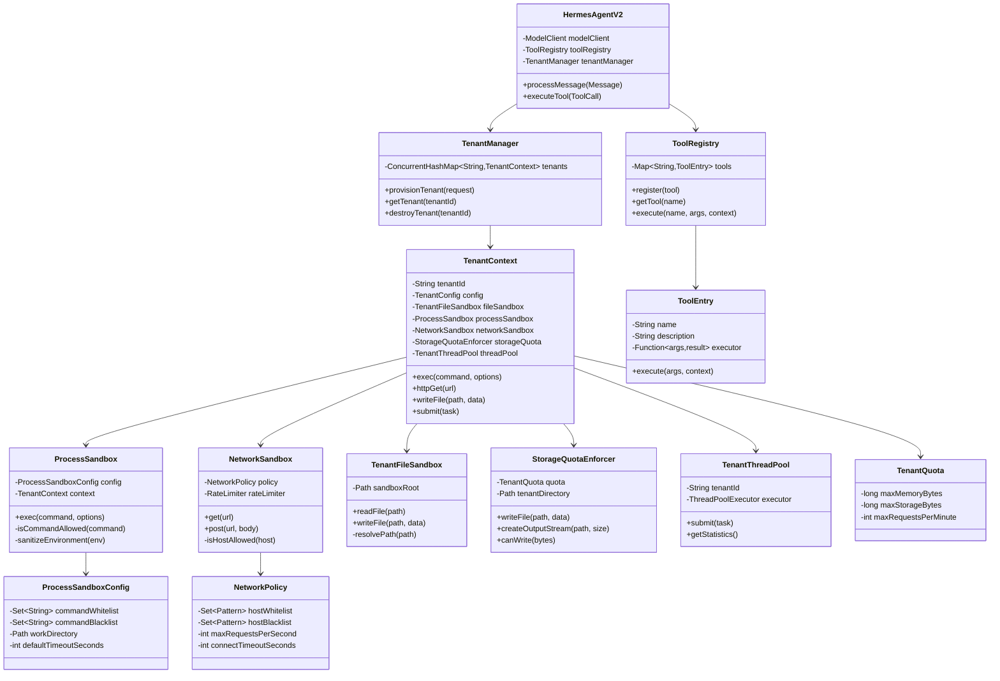

---

## 八、状态机图

### 8.1 租户生命周期状态机

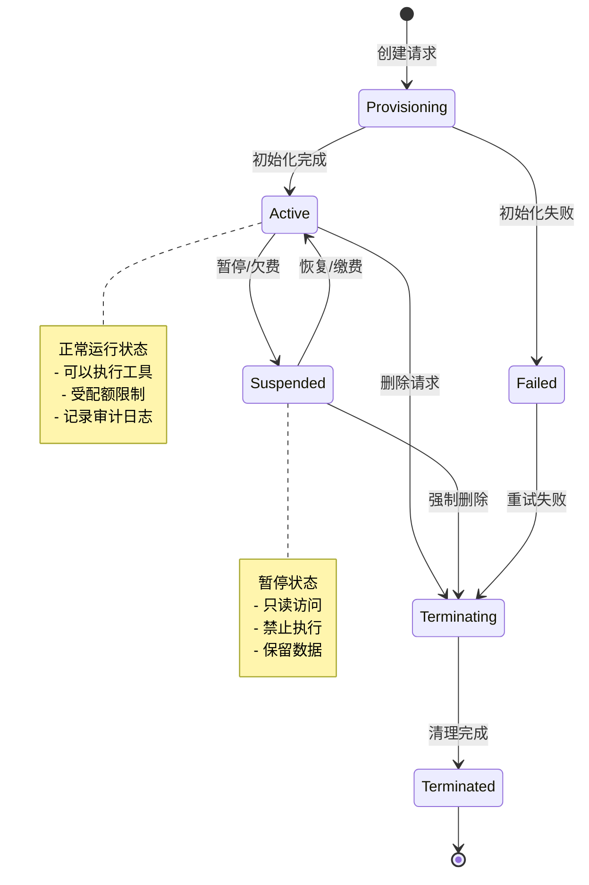

### 8.2 工具执行状态机

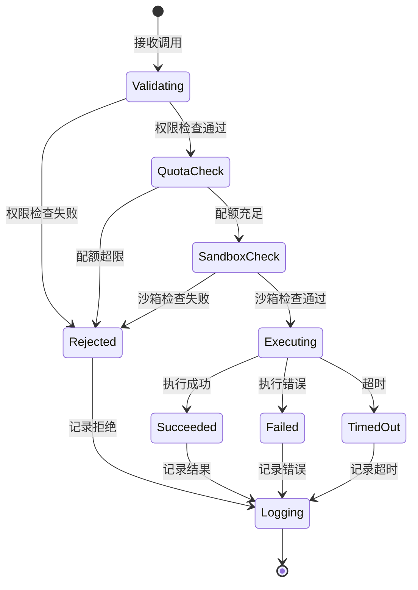

---

## 九、下一步迭代规划建议

基于架构图分析，建议按以下优先级进行迭代：

### Phase 1: 基础安全加固（已完成✅）
- ✅ 文件沙箱隔离
- ✅ 进程沙箱（命令白名单、超时控制）
- ✅ 网络沙箱（URL白名单、速率限制）
- ✅ 存储配额强制执行

### Phase 2: 高级隔离（建议1-2周内完成）
- 🔄 Linux cgroups 集成（CPU/内存/PID限制）
- 🔄 网络代理模式（透明拦截所有出站连接）
- 🔄 JVM 内存隔离（ByteBuffer分配池）

### Phase 3: 可观测性（建议2-3周内完成）
- 📊 JMX指标暴露（MBean）
- 📊 Prometheus集成
- 📊 Grafana仪表板
- 📊 实时资源监控告警

### Phase 4: 高可用性（建议1个月内完成）
- 🔄 租户状态持久化（数据库）
- 🔄 分布式会话管理
- 🔄 优雅重启/热升级
- 🔄 多节点租户迁移

### Phase 5: 高级功能（长期规划）
- 🔮 容器化隔离（Docker/Podman）
- 🔮 GPU资源隔离
- 🔮 多租户资源调度算法
- 🔮 自动扩缩容

---

*文档生成时间: 2026-04-29*
*版本: v1.0*
