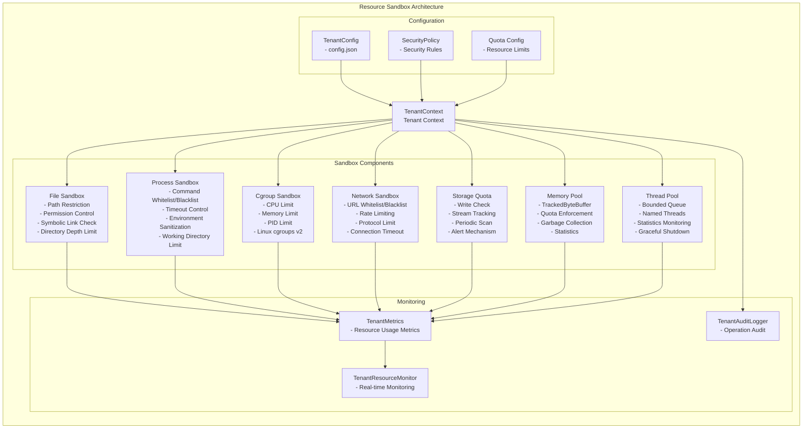
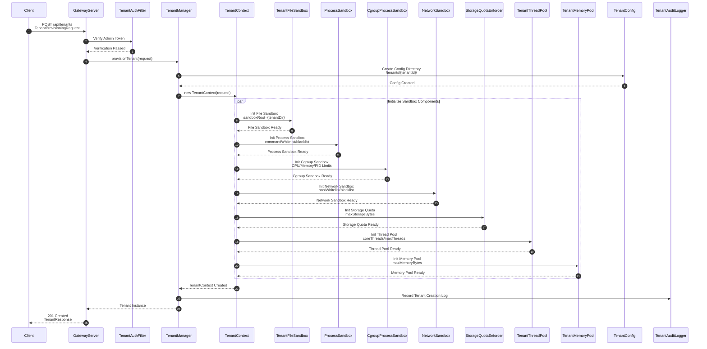
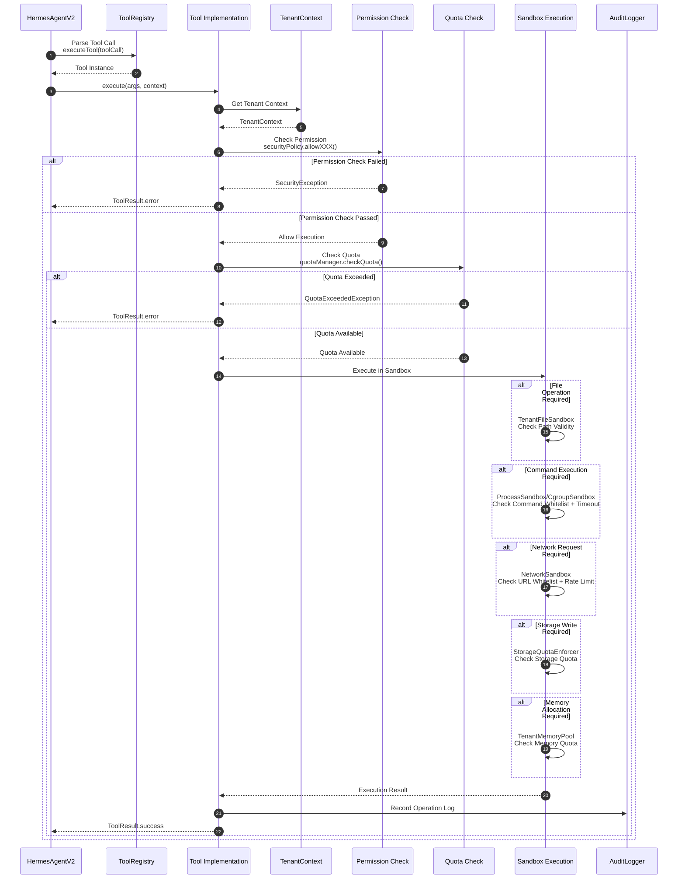
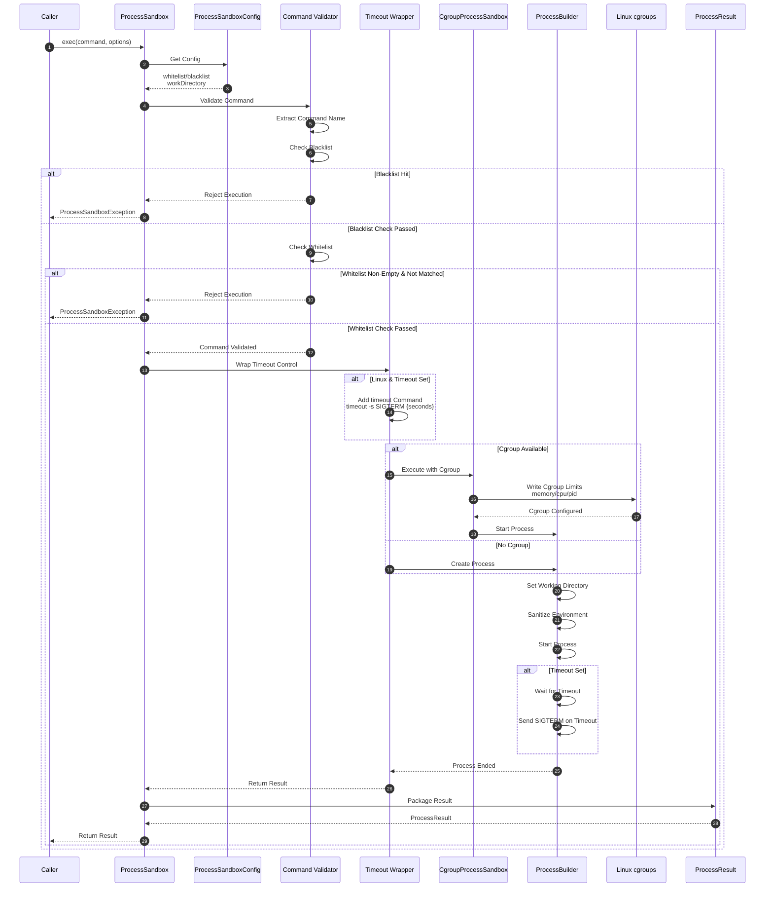
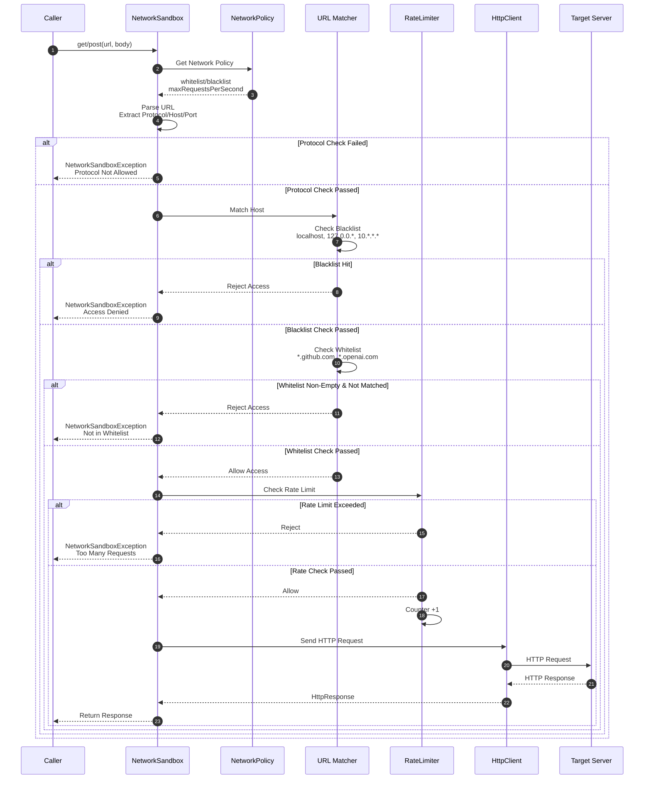
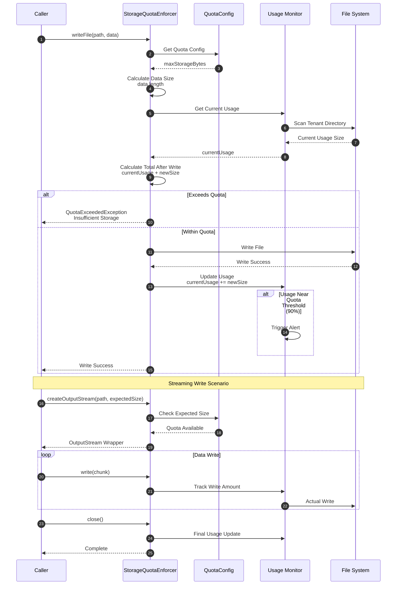

# Hermes Agent Java

Java implementation of Hermes Agent - a self-improving AI agent with tool calling capabilities and multi-tenant isolation.

## Project Overview

Hermes Agent Java is a production-grade AI agent platform featuring:
- **Multi-Model Support**: OpenAI, Anthropic, OpenRouter, and local endpoints
- **Tool System**: 40+ built-in tools with MCP protocol support
- **Multi-Tenant Architecture**: Complete resource isolation between tenants
- **Sandbox Security**: File, process, network, and memory sandboxing
- **Gateway**: Multi-platform messaging (Telegram, Discord, Slack, Feishu, QQ)
- **Skills System**: Self-improving skills from experience

---

## System Architecture

### Overall Architecture Diagram

```mermaid
graph TB
    subgraph "External Layer"
        Users[Users/Clients]
        Platforms[Message Platforms<br/>Discord/Telegram/Feishu/QQ]
        ExternalAPIs[External APIs<br/>OpenAI/Anthropic/Brave]
    end

    subgraph "Gateway Layer"
        Gateway[GatewayServer<br/>HTTP WebSocket Service]
        AuthFilter[TenantAuthFilter<br/>Tenant Authentication]
        RateLimiter[API Rate Limiter<br/>Tenant-level Throttling]
        
        subgraph "Platform Adapters"
            FeishuAdapter[FeishuAdapter]
            TelegramAdapter[TelegramAdapter]
            DiscordAdapter[DiscordAdapter]
            QQBotAdapter[QQBotAdapter]
        end
    end

    subgraph "Core Engine"
        Agent[HermesAgentV2<br/>Core Agent Engine]
        ModelClient[ModelClient<br/>LLM Client]
        SessionMgr[SessionManager<br/>Session Management]
        
        subgraph "Model Transports"
            OpenAI[OpenAITransport]
            Anthropic[AnthropicTransport]
            Bedrock[BedrockTransport]
            OpenRouter[OpenRouterTransport]
        end
    end

    subgraph "Tool System"
        ToolRegistry[ToolRegistry<br/>Tool Registry Center]
        ToolInit[ToolInitializerV2<br/>Tool Initializer]
        
        subgraph "Built-in Tools"
            FileTool[FileTool<br/>File Operations]
            CodeTool[CodeTool<br/>Code Execution]
            Browser[BrowserToolV2<br/>Browser Control]
            WebSearch[WebSearchToolV2<br/>Web Search]
            Terminal[TerminalTool<br/>Terminal Execution]
            GitTool[GitTool<br/>Version Control]
            MCPTool[MCPTool<br/>MCP Protocol]
            SubAgent[SubAgentTool<br/>Sub-Agent]
        end
        
        subgraph "Platform Tools"
            FeishuTool[FeishuDocTool<br/>Feishu Docs]
            DiscordTool[DiscordTool<br/>Discord]
            QQTool[QQBotTool<br/>QQ Bot]
        end
    end

    subgraph "Multi-Tenant System"
        TenantMgr[TenantManager<br/>Tenant Manager]
        TenantCtx[TenantContext<br/>Tenant Context]
        
        subgraph "Resource Isolation"
            FileSandbox[TenantFileSandbox<br/>File Sandbox]
            ProcessSandbox[ProcessSandbox<br/>Process Sandbox]
            CgroupSandbox[CgroupProcessSandbox<br/>Cgroup Sandbox]
            NetworkSandbox[NetworkSandbox<br/>Network Sandbox]
            StorageQuota[StorageQuotaEnforcer<br/>Storage Quota]
            MemoryPool[TenantMemoryPool<br/>Memory Pool]
            ThreadPool[TenantThreadPool<br/>Thread Pool Isolation]
        end
        
        subgraph "Tenant Management"
            Config[TenantConfig<br/>Tenant Config]
            Quota[TenantQuotaManager<br/>Resource Quota]
            Security[TenantSecurityPolicy<br/>Security Policy]
            Audit[TenantAuditLogger<br/>Audit Logger]
            SkillMgr[TenantSkillManager<br/>Skill Manager]
            MemoryMgr[TenantMemoryManager<br/>Memory Manager]
        end
        
        subgraph "Monitoring"
            Metrics[TenantMetrics<br/>Metrics Collection]
            ResourceMonitor[TenantResourceMonitor<br/>Resource Monitor]
        end
    end

    subgraph "Storage Layer"
        LocalFS[Local File System<br/>sandbox/{tenantId}/]
        GitRepos[Git Repositories]
        MCPServers[MCP Servers]
    end

    %% Connections
    Users -->|HTTP/WebSocket| Gateway
    Platforms -->|Webhook| Gateway
    
    Gateway --> AuthFilter
    AuthFilter --> RateLimiter
    RateLimiter --> Agent
    
    Gateway --> FeishuAdapter & TelegramAdapter & DiscordAdapter & QQBotAdapter
    
    Agent --> ModelClient
    ModelClient --> OpenAI & Anthropic & Bedrock & OpenRouter
    ModelClient --> ExternalAPIs
    
    Agent --> ToolRegistry
    Agent --> SessionMgr
    ToolRegistry --> ToolInit
    ToolInit --> FileTool & CodeTool & Browser & WebSearch & Terminal & GitTool & MCPTool & SubAgent
    ToolInit --> FeishuTool & DiscordTool & QQTool
    
    Agent --> TenantMgr
    TenantMgr --> TenantCtx
    TenantCtx --> FileSandbox & ProcessSandbox & CgroupSandbox & NetworkSandbox & StorageQuota & MemoryPool & ThreadPool
    TenantCtx --> Config & Quota & Security & Audit & SkillMgr & MemoryMgr
    TenantCtx --> Metrics & ResourceMonitor
    
    FileSandbox --> LocalFS
    ProcessSandbox --> LocalFS
    Terminal --> LocalFS
    GitTool --> GitRepos
    MCPTool --> MCPServers
```

---

## Tenant Isolation Architecture

### Multi-Layer Isolation Model

```mermaid
graph TB
    subgraph "Physical Layer"
        JVM[JVM Process]
        OS[Operating System]
        Hardware[Hardware Resources]
    end

    subgraph "Tenant Isolation Layer"
        direction TB
        
        subgraph "Tenant A"
            TA_Config[Independent Config]
            TA_FS[File Sandbox<br/>/sandbox/tenant-a/]
            TA_Process[Process Sandbox<br/>Resource Limits]
            TA_Cgroup[Cgroup Sandbox<br/>CPU/Memory Limits]
            TA_Network[Network Sandbox<br/>Whitelist Control]
            TA_Thread[Thread Pool<br/>10 threads max]
            TA_Storage[Storage Quota<br/>1GB limit]
            TA_Memory[Memory Pool<br/>256MB limit]
        end
        
        subgraph "Tenant B"
            TB_Config[Independent Config]
            TB_FS[File Sandbox<br/>/sandbox/tenant-b/]
            TB_Process[Process Sandbox<br/>Resource Limits]
            TB_Cgroup[Cgroup Sandbox<br/>CPU/Memory Limits]
            TB_Network[Network Sandbox<br/>Whitelist Control]
            TB_Thread[Thread Pool<br/>10 threads max]
            TB_Storage[Storage Quota<br/>1GB limit]
            TB_Memory[Memory Pool<br/>256MB limit]
        end
        
        subgraph "Tenant C"
            TC_Config[Independent Config]
            TC_FS[File Sandbox<br/>/sandbox/tenant-c/]
            TC_Process[Process Sandbox<br/>Resource Limits]
            TC_Cgroup[Cgroup Sandbox<br/>CPU/Memory Limits]
            TC_Network[Network Sandbox<br/>Whitelist Control]
            TC_Thread[Thread Pool<br/>10 threads max]
            TC_Storage[Storage Quota<br/>1GB limit]
            TC_Memory[Memory Pool<br/>256MB limit]
        end
    end

    subgraph "Shared Resources (Read-Only)"
        Shared_Model[Model Client<br/>Shared Connection Pool]
        Shared_Tool[Tool Registry<br/>Read-Only Shared]
        Shared_Platform[Platform Adapters<br/>Multiplexed]
    end

    %% Isolation boundaries
    TA_FS -.->|Complete Isolation| TB_FS
    TA_FS -.->|Complete Isolation| TC_FS
    TA_Process -.->|Command Whitelist| TB_Process
    TA_Cgroup -.->|cgroups v2| TB_Cgroup
    TA_Network -.->|Independent Policy| TB_Network
    
    %% Resource usage
    TenantA -->|Uses| TA_FS & TA_Process & TA_Cgroup & TA_Network & TA_Thread & TA_Storage & TA_Memory
    TenantB -->|Uses| TB_FS & TB_Process & TB_Cgroup & TB_Network & TB_Thread & TB_Storage & TB_Memory
    TenantC -->|Uses| TC_FS & TC_Process & TC_Cgroup & TC_Network & TC_Thread & TC_Storage & TC_Memory
    
    %% Shared access
    TenantA & TenantB & TenantC -->|Shared Access| Shared_Model & Shared_Tool & Shared_Platform
```



### Resource Sandbox Detailed Architecture



---

## Key Logic Flow Sequence Diagrams

### 1. Tenant Creation Flow



### 2. Tool Execution Flow (With Resource Limits)



### 3. Process Sandbox Execution Flow



### 4. Network Sandbox Request Flow



### 5. Storage Quota Check Flow



---

## Class Diagram

### Core Class Relationships

```mermaid
classDiagram
    class HermesAgentV2 {
        -ConfigManager config
        -ApprovalSystem approvalSystem
        -ToolRegistry toolRegistry
        -SessionManager sessionManager
        -GatewayServer gatewayServer
        +start()
        +runInteractive()
        -registerAdapters()
        -processMessage(String)
    }

    class TenantManager {
        -ConcurrentHashMap~String,TenantContext~ tenants
        +provisionTenant(request)
        +getTenant(tenantId)
        +destroyTenant(tenantId)
        +listTenants()
    }

    class TenantContext {
        -String tenantId
        -Path tenantDir
        -AtomicReference~State~ state
        -ReentrantReadWriteLock lifecycleLock
        -TenantConfig config
        -TenantFileSandbox fileSandbox
        -ProcessSandbox processSandbox
        -CgroupProcessSandbox cgroupSandbox
        -NetworkSandbox networkSandbox
        -StorageQuotaEnforcer storageQuota
        -TenantMemoryPool memoryPool
        -TenantThreadPool threadPool
        -TenantQuotaManager quotaManager
        -TenantAuditLogger auditLogger
        -TenantSecurityPolicy securityPolicy
        -TenantMetrics metrics
        +exec(List~String~, ProcessOptions)
        +httpGet(String)
        +httpPost(String, String)
        +allocateMemory(int)
        +freeMemory(ByteBuffer)
        +createAgent(String)
        +destroy(boolean)
        +suspend(String)
        +resume()
    }

    class ToolRegistry {
        -Map~String,ToolEntry~ tools
        -Map~String,Function~ toolsetChecks
        +register(ToolEntry)
        +deregister(String)
        +dispatch(String, Map)
        +getDefinitions(Set~String~, boolean)
        +getAllToolNames()
        +getAllTools()
    }

    class ToolEntry {
        -String name
        -String toolset
        -String description
        -Map~String,Object~ schema
        -Function~Map,String~ handler
        +execute(Map, TenantContext)
        +getSchema()
        +getName()
    }

    class ProcessSandbox {
        -TenantContext context
        -ProcessSandboxConfig config
        +exec(List~String~, ProcessOptions)
        -isCommandAllowed(String)
        -sanitizeEnvironment(Map)
        -buildRestrictedProcess(List, ProcessOptions)
    }

    class CgroupProcessSandbox {
        -TenantContext context
        -ProcessSandboxConfig config
        -Path cgroupPath
        +initialize()
        +exec(List~String~, ProcessOptions)
        +destroy()
        +isCgroupV2Available()
    }

    class NetworkSandbox {
        -NetworkPolicy policy
        -RateLimiter rateLimiter
        -HttpClient httpClient
        +get(String)
        +post(String, String)
        +execute(HttpRequest)
        -isHostAllowed(String)
    }

    class TenantFileSandbox {
        -String tenantId
        -Path sandboxRoot
        +readFile(Path)
        +writeFile(Path, byte[])
        +resolvePath(String)
        -validatePath(Path)
    }

    class StorageQuotaEnforcer {
        -TenantQuota quota
        -Path tenantDirectory
        +writeFile(Path, byte[])
        +createOutputStream(Path, long)
        +canWrite(long)
        -scanDirectoryUsage()
    }

    class TenantMemoryPool {
        -String tenantId
        -long maxMemoryBytes
        -AtomicLong usedMemory
        -List~TrackedByteBuffer~ activeBuffers
        +allocate(int)
        +free(TrackedByteBuffer)
        +getStats()
    }

    class TenantThreadPool {
        -String tenantId
        -ThreadPoolExecutor executor
        +submit(Runnable)
        +getStatistics()
        +shutdown()
    }

    class ModelClient {
        -HermesConfig config
        -OkHttpClient httpClient
        +chatCompletion(List~ModelMessage~, List~Map~, boolean)
        -parseCompletionResponse(JSONObject)
        +testConnection()
    }

    class GatewayServer {
        -int port
        -HermesConfig config
        -Map~String,PlatformAdapter~ adapters
        +start()
        +stop()
        +registerAdapter(PlatformAdapter)
        -handleRequest(HttpExchange)
    }

    class TenantQuotaManager {
        -Path tenantDir
        -TenantQuota quota
        -AtomicInteger dailyRequestCount
        -AtomicLong dailyTokenCount
        +checkQuota()
        +checkConcurrentAgents(int)
        +checkStorageQuota(long)
        +recordRequest(int)
        +recordTokens(int)
    }

    class TenantSecurityPolicy {
        -Set~String~ allowedTools
        -Set~String~ deniedTools
        -NetworkPolicy networkPolicy
        -boolean allowCodeExecution
        +checkPermission(String, Map)
        +isHostAllowed(String)
        +isCommandAllowed(String)
    }

    class TenantAuditLogger {
        -Path logDirectory
        -BlockingQueue~AuditEvent~ eventQueue
        +log(AuditEventType, Map)
        +queryLogs(Instant, Instant)
        +exportLogs(Path)
    }

    class ProcessSandboxConfig {
        -Set~String~ commandWhitelist
        -Set~String~ commandBlacklist
        -Path workDirectory
        -int defaultTimeoutSeconds
        +defaultConfig()
    }

    class NetworkPolicy {
        -Set~Pattern~ hostWhitelist
        -Set~Pattern~ hostBlacklist
        -int maxRequestsPerSecond
        -int connectTimeoutSeconds
        +defaultPolicy()
    }

    class TenantQuota {
        -long maxMemoryBytes
        -long maxStorageBytes
        -int maxRequestsPerMinute
        -int maxConcurrentAgents
        -int maxToolCallsPerSession
    }

    HermesAgentV2 --> TenantManager
    HermesAgentV2 --> ToolRegistry
    HermesAgentV2 --> GatewayServer
    HermesAgentV2 --> ModelClient
    
    TenantManager --> TenantContext
    ToolRegistry --> ToolEntry
    
    TenantContext --> ProcessSandbox
    TenantContext --> CgroupProcessSandbox
    TenantContext --> NetworkSandbox
    TenantContext --> TenantFileSandbox
    TenantContext --> StorageQuotaEnforcer
    TenantContext --> TenantMemoryPool
    TenantContext --> TenantThreadPool
    TenantContext --> TenantQuotaManager
    TenantContext --> TenantSecurityPolicy
    TenantContext --> TenantAuditLogger
    
    ProcessSandbox --> ProcessSandboxConfig
    CgroupProcessSandbox --> ProcessSandboxConfig
    NetworkSandbox --> NetworkPolicy
    TenantContext --> TenantQuota
    TenantSecurityPolicy --> NetworkPolicy
```



---

## Deployment Architecture

```mermaid
graph TB
    subgraph "Client Layer"
        WebUI[Web UI]
        CLI[CLI Client]
        Mobile[Mobile App]
    end

    subgraph "Load Balancer"
        LB[Nginx/ALB
        - SSL Termination
        - Load Balancing
        - Static Resource Cache]
    end

    subgraph "Hermes Agent Cluster"
        Node1[Hermes Node 1
        - GatewayServer
        - TenantManager
        - Agent Engine
        - Resource Sandbox]
        
        Node2[Hermes Node 2
        - GatewayServer
        - TenantManager
        - Agent Engine
        - Resource Sandbox]
        
        Node3[Hermes Node 3
        - GatewayServer
        - TenantManager
        - Agent Engine
        - Resource Sandbox]
    end

    subgraph "Shared Storage"
        NFS[NFS/EFS
        - Tenant File Persistence
        - /sandbox/{tenantId}/]
        
        Redis[Redis Cluster
        - Session Cache
        - Rate Limit Counter
        - Distributed Lock]
        
        DB[(PostgreSQL
        - Tenant Metadata
        - Audit Logs
        - Configuration)]
    end

    subgraph "External Services"
        OpenAI[OpenAI API]
        Anthropic[Anthropic API]
        Search[Search APIs
        - Brave/Tavily]
        MCP[MCP Servers]
    end

    subgraph "Monitoring"
        Prometheus[Prometheus
        - Metrics Collection]
        Grafana[Grafana
        - Visualization Dashboard]
        ELK[ELK Stack
        - Log Analysis]
        Jaeger[Jaeger
        - Distributed Tracing]
    end

    WebUI & CLI & Mobile --> LB
    LB --> Node1 & Node2 & Node3
    
    Node1 & Node2 & Node3 --> NFS
    Node1 & Node2 & Node3 --> Redis
    Node1 & Node2 & Node3 --> DB
    
    Node1 & Node2 & Node3 --> OpenAI & Anthropic & Search & MCP
    
    Node1 & Node2 & Node3 --> Prometheus
    Node1 & Node2 & Node3 --> ELK
    Node1 & Node2 & Node3 --> Jaeger
    Prometheus --> Grafana
```

---

## Project Structure

```
hermes-agent-java/
├── pom.xml                          # Maven configuration
├── src/
│   ├── main/
│   │   ├── java/
│   │   │   └── com/nousresearch/hermes/
│   │   │       ├── HermesAgentV2.java           # Main entry point
│   │   │       ├── agent/
│   │   │       │   ├── AIAgent.java             # Core agent implementation
│   │   │       │   ├── ConversationLoop.java    # Conversation management
│   │   │       │   ├── IterationBudget.java     # Iteration tracking
│   │   │       │   ├── PromptBuilder.java       # System prompt assembly
│   │   │       │   ├── MemoryManager.java       # Memory management
│   │   │       │   └── ContextCompressor.java   # Context compression
│   │   │       ├── gateway/
│   │   │       │   ├── GatewayServer.java       # Gateway entry point
│   │   │       │   ├── GatewayConfig.java       # Gateway configuration
│   │   │       │   ├── SessionManager.java      # Session management
│   │   │       │   └── platforms/               # Platform adapters
│   │   │       │       ├── PlatformAdapter.java
│   │   │       │       ├── FeishuAdapterV2.java
│   │   │       │       ├── TelegramAdapter.java
│   │   │       │       ├── DiscordAdapter.java
│   │   │       │       └── QQBotAdapter.java
│   │   │       ├── tools/
│   │   │       │   ├── ToolRegistry.java        # Tool registration
│   │   │       │   ├── ToolEntry.java           # Tool metadata
│   │   │       │   ├── ToolInitializerV2.java   # Tool initialization
│   │   │       │   └── impl/                    # Tool implementations
│   │   │       │       ├── FileTool.java
│   │   │       │       ├── CodeTool.java
│   │   │       │       ├── BrowserToolV2.java
│   │   │       │       ├── WebSearchToolV2.java
│   │   │       │       ├── TerminalTool.java
│   │   │       │       ├── GitTool.java
│   │   │       │       ├── MCPTool.java
│   │   │       │       ├── SubAgentTool.java
│   │   │       │       ├── FeishuDocTool.java
│   │   │       │       ├── DiscordTool.java
│   │   │       │       └── impl/web/            # Web search backends
│   │   │       │           ├── WebSearchBackend.java
│   │   │       │           ├── BraveBackend.java
│   │   │       │           ├── TavilyBackend.java
│   │   │       │           └── FirecrawlBackend.java
│   │   │       ├── tenant/                      # Multi-tenant system
│   │   │       │   ├── core/
│   │   │       │   │   ├── TenantContext.java       # Tenant runtime context
│   │   │       │   │   ├── TenantManager.java       # Tenant lifecycle management
│   │   │       │   │   ├── TenantConfig.java        # Tenant configuration
│   │   │       │   │   ├── TenantQuotaManager.java  # Resource quota management
│   │   │       │   │   ├── TenantSecurityPolicy.java # Security policy
│   │   │       │   │   ├── TenantAuditLogger.java   # Audit logging
│   │   │       │   │   ├── TenantSessionManager.java # Session management
│   │   │       │   │   ├── TenantMemoryManager.java # Memory management
│   │   │       │   │   ├── TenantSkillManager.java  # Skill management
│   │   │       │   │   ├── TenantToolRegistry.java  # Tenant tool registry
│   │   │       │   │   ├── TenantAIAgent.java       # Tenant AI agent
│   │   │       │   │   └── TenantResourceMonitor.java # Resource monitoring
│   │   │       │   ├── sandbox/                 # Resource isolation
│   │   │       │   │   ├── ProcessSandbox.java      # Process sandbox
│   │   │       │   │   ├── CgroupProcessSandbox.java # Cgroup-based sandbox
│   │   │       │   │   ├── NetworkSandbox.java      # Network sandbox
│   │   │       │   │   ├── TenantFileSandbox.java   # File sandbox
│   │   │       │   │   ├── StorageQuotaEnforcer.java # Storage quota
│   │   │       │   │   ├── TenantMemoryPool.java    # Memory pool
│   │   │       │   │   ├── TenantThreadPool.java    # Thread pool
│   │   │       │   │   ├── RestrictedHttpClient.java # Restricted HTTP
│   │   │       │   │   ├── ProcessSandboxConfig.java # Process config
│   │   │       │   │   ├── NetworkPolicy.java       # Network policy
│   │   │       │   │   └── ProcessOptions.java      # Process options
│   │   │       │   ├── tools/                   # Tenant-aware tools
│   │   │       │   │   ├── TenantAwareCodeTool.java
│   │   │       │   │   └── TenantAwareSkillTool.java
│   │   │       │   ├── metrics/                 # Metrics collection
│   │   │       │   │   ├── TenantMetrics.java
│   │   │       │   │   ├── TenantMetricsMBean.java
│   │   │       │   │   └── MetricsCollector.java
│   │   │       │   └── audit/                   # Audit system
│   │   │       │       ├── AuditEvent.java
│   │   │       │       └── AuditEventType.java
│   │   │       ├── model/
│   │   │       │   ├── ModelClient.java         # LLM client
│   │   │       │   ├── ModelMessage.java        # Message types
│   │   │       │   └── ToolCall.java            # Tool call structure
│   │   │       ├── config/
│   │   │       │   ├── ConfigManager.java       # Configuration management
│   │   │       │   ├── HermesConfig.java        # Hermes configuration
│   │   │       │   └── Constants.java           # Constants
│   │   │       ├── skills/
│   │   │       │   ├── SkillManager.java        # Skill management
│   │   │       │   └── SkillHubClient.java      # Skill hub client
│   │   │       └── util/
│   │   │           ├── SafeWriter.java          # Safe stdio wrapper
│   │   │           └── JsonUtils.java           # JSON utilities
│   │   └── resources/
│   │       └── default-config.yaml
│   └── test/
│       └── java/com/nousresearch/hermes/
│           ├── ConfigTest.java
│           ├── ToolRegistryTest.java
│           └── tenant/sandbox/
│               ├── NetworkSandboxTest.java
│               ├── ProcessSandboxTest.java
│               ├── TenantFileSandboxTest.java
│               ├── TenantMemoryPoolTest.java
│               └── ProcessSandboxIntegrationTest.java
├── scripts/
│   └── install.sh
├── monitoring/
│   └── prometheus/
│       ├── prometheus.yml
│       └── rules/
│           └── tenant-alerts.yml
├── web/                             # Web UI
├── ui-tui/                          # Terminal UI
└── docs/
    └── DEPLOYMENT.md
```

---

## Quick Start

### Build

```bash
# Build with Maven
mvn clean package

# Run tests
mvn test
```

### Run CLI Mode

```bash
# Run interactive mode
java -jar target/hermes-agent-java-0.1.0.jar

# With custom config
java -jar target/hermes-agent-java-0.1.0.jar --config /path/to/config.yaml
```

### Run Gateway Mode

```bash
# Start gateway server
java -jar target/hermes-agent-java-0.1.0.jar gateway

# With custom port
java -jar target/hermes-agent-java-0.1.0.jar gateway --port 8080
```

### Environment Variables

```bash
# Required for LLM
export OPENAI_API_KEY=sk-...
export OPENROUTER_API_KEY=sk-...

# Optional platform integrations
export FEISHU_APP_ID=cli_...
export FEISHU_APP_SECRET=...
export TELEGRAM_BOT_TOKEN=...
export DISCORD_BOT_TOKEN=...

# Optional search backends
export BRAVE_API_KEY=...
export TAVILY_API_KEY=...
```

---

## Configuration

Configuration is loaded from `~/.hermes/config.yaml`:

```yaml
model:
  provider: openrouter
  model: anthropic/claude-3.5-sonnet
  api_key: ${OPENROUTER_API_KEY}
  base_url: https://openrouter.ai/api/v1

tools:
  enabled:
    - web_search
    - terminal
    - file_operations
    - browser
    - code_execution

gateway:
  port: 8080
  enabled_platforms:
    - telegram
    - feishu
    - discord

sandbox:
  process:
    command_whitelist:
      - git
      - python3
      - node
      - npm
      - mvn
    command_blacklist:
      - rm
      - mkfs
      - dd
      - sudo
  network:
    host_whitelist:
      - "*.github.com"
      - "*.openai.com"
      - "api.openrouter.ai"
    host_blacklist:
      - "localhost"
      - "127.0.0.*"
      - "10.*.*.*"
      - "192.168.*.*"
    max_requests_per_second: 10
  quota:
    max_storage_bytes: 1073741824  # 1GB
    max_memory_bytes: 268435456     # 256MB
    max_concurrent_agents: 5
```

---

## Tenant Isolation Features

### File System Isolation

- **Path Restriction**: All file operations restricted to tenant's sandbox directory
- **Symbolic Link Check**: Prevents symlink escape attacks
- **Directory Depth Limit**: Maximum 10 levels of directory nesting
- **Storage Quota**: Configurable per-tenant storage limit

### Process Isolation

- **Command Whitelist/Blacklist**: Controls allowed system commands
- **Timeout Control**: Automatic process termination after timeout
- **Environment Sanitization**: Removes sensitive environment variables
- **Cgroup Support**: Linux cgroups v2 for resource limiting (CPU, memory, PIDs)

### Network Isolation

- **Protocol Restriction**: Only HTTP/HTTPS allowed by default
- **Host Whitelist/Blacklist**: Fine-grained host access control
- **Rate Limiting**: Per-tenant request rate limiting
- **Connection Timeout**: Prevents long-hanging connections

### Memory Isolation

- **TrackedByteBuffer**: Monitored memory allocation
- **Memory Pool**: Per-tenant memory quota
- **Automatic Cleanup**: Garbage collection tracking

### Thread Isolation

- **Bounded Queue**: Prevents thread exhaustion
- **Named Threads**: Easy identification and monitoring
- **Graceful Shutdown**: Clean thread pool termination

---

## Monitoring and Observability

### Metrics

| Metric | Type | Description |
|--------|------|-------------|
| `tenant.active` | Gauge | Active tenant count |
| `tenant.requests.total` | Counter | Total tenant requests |
| `tenant.requests.rate` | Rate | Request rate per second |
| `tenant.quota.usage` | Gauge | Quota usage percentage |
| `tenant.storage.bytes` | Gauge | Storage usage in bytes |
| `tenant.memory.bytes` | Gauge | Memory usage in bytes |
| `tenant.tool.calls` | Counter | Tool call count |
| `tenant.audit.events` | Counter | Audit event count |
| `tenant.security.violations` | Counter | Security violation count |

### JMX MBeans

```java
// Access tenant metrics via JMX
TenantMetricsMBean metrics = tenantContext.getMetrics();
long memoryUsage = metrics.getUsedMemoryBytes();
int activeAgents = metrics.getActiveAgentCount();
double quotaUsage = metrics.getQuotaUsagePercent();
```

### Prometheus Integration

```yaml
# prometheus.yml
scrape_configs:
  - job_name: 'hermes-agent'
    static_configs:
      - targets: ['localhost:8080']
    metrics_path: '/metrics'
```

---

## API Endpoints

### Tenant Management

```
POST   /api/v1/tenants              # Create tenant
GET    /api/v1/tenants/:id          # Get tenant info
DELETE /api/v1/tenants/:id          # Delete tenant
POST   /api/v1/tenants/:id/suspend  # Suspend tenant
POST   /api/v1/tenants/:id/resume   # Resume tenant
```

### Resource Quota

```
GET    /api/v1/tenants/:id/quota    # Get quota
PUT    /api/v1/tenants/:id/quota    # Update quota
GET    /api/v1/tenants/:id/usage    # Get usage stats
```

### Security Policy

```
GET    /api/v1/tenants/:id/security # Get security policy
PUT    /api/v1/tenants/:id/security # Update security policy
```

### Audit Logs

```
GET    /api/v1/tenants/:id/audit           # Get audit logs
GET    /api/v1/tenants/:id/audit/export    # Export audit logs
```

---

## Security Considerations

### Threat Model and Mitigations

| Threat | Mitigation |
|--------|------------|
| Path Traversal | Path validation + sandbox root restriction |
| Symlink Escape | Symbolic link resolution check |
| Command Injection | Command whitelist + parameter validation |
| Environment Leak | Environment variable sanitization |
| SSRF | URL whitelist + blacklist filtering |
| Resource Exhaustion | Quota enforcement + timeout control |
| Privilege Escalation | cgroups + seccomp (planned) |

### Security Best Practices

1. **Use Whitelist Mode**: Explicitly allow commands and hosts
2. **Enable Audit Logging**: Record all sandbox operations
3. **Set Reasonable Limits**: Configure appropriate quotas
4. **Monitor Alerts**: Set up alerts for quota violations
5. **Regular Reviews**: Periodically review whitelist configurations

---

## License

MIT License - See LICENSE file

---

## Contributing

Contributions are welcome! Please read our [Contributing Guide](CONTRIBUTING.md) for details.

---

*Last updated: 2026-05-03*
*Version: 0.1.0*
