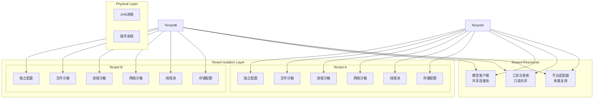
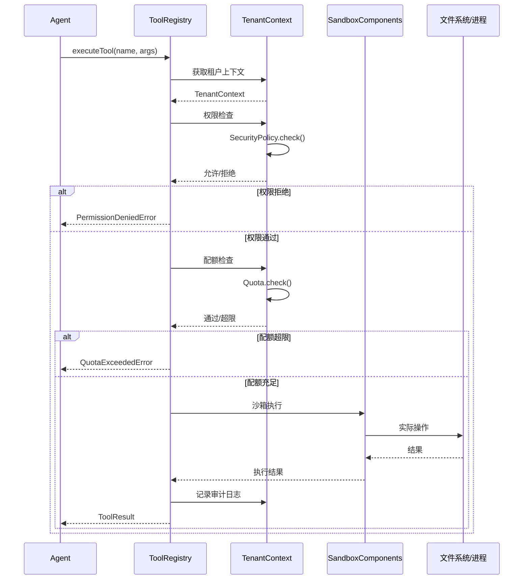
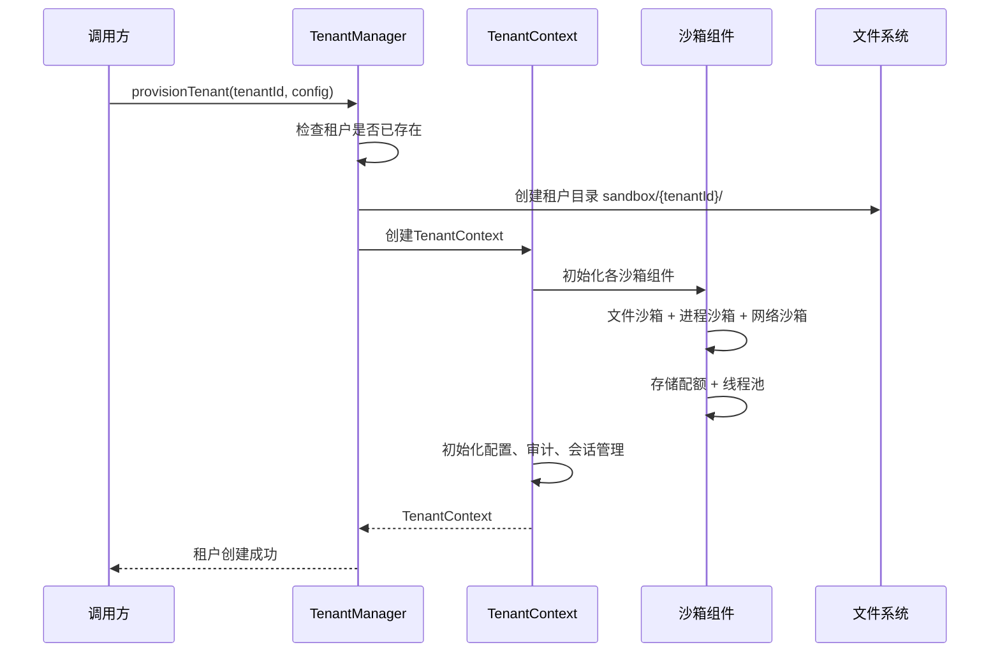
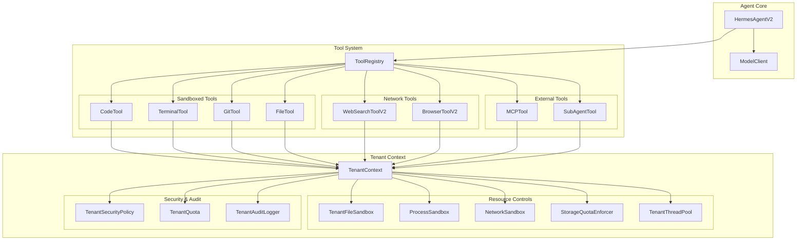
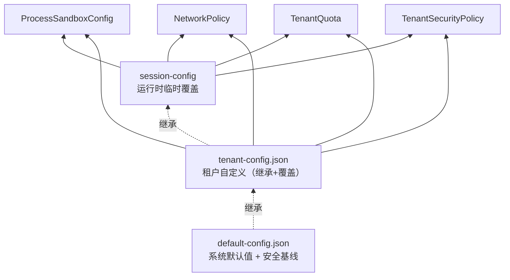
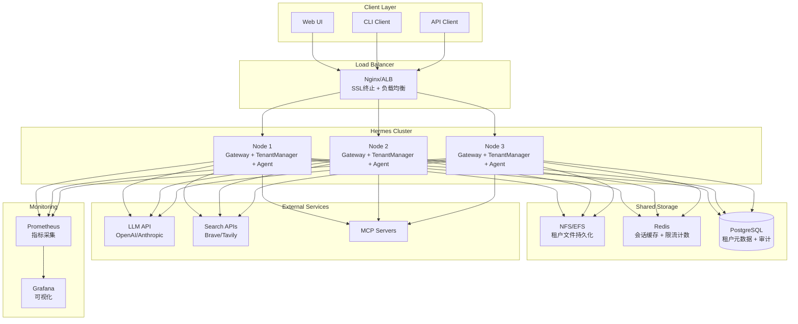
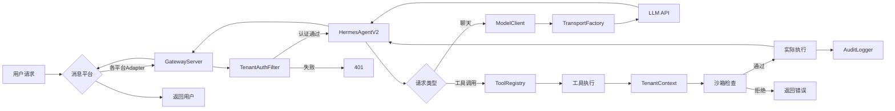
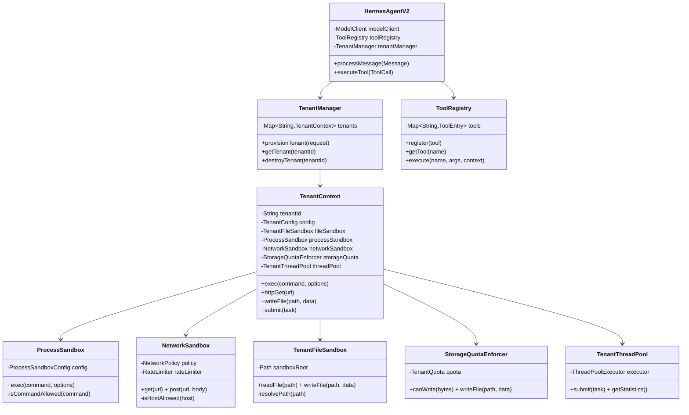
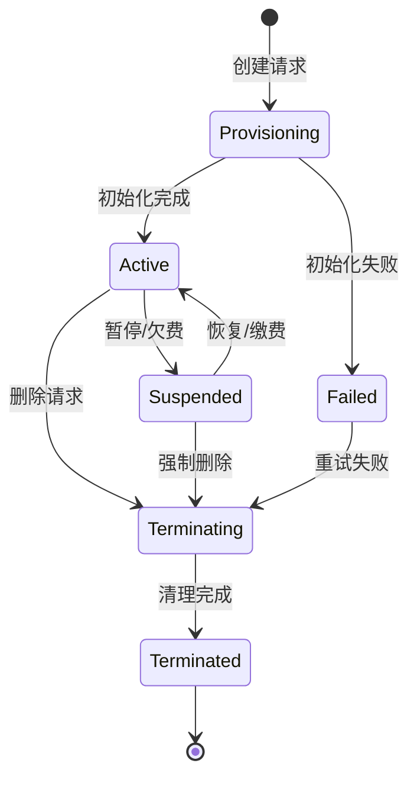
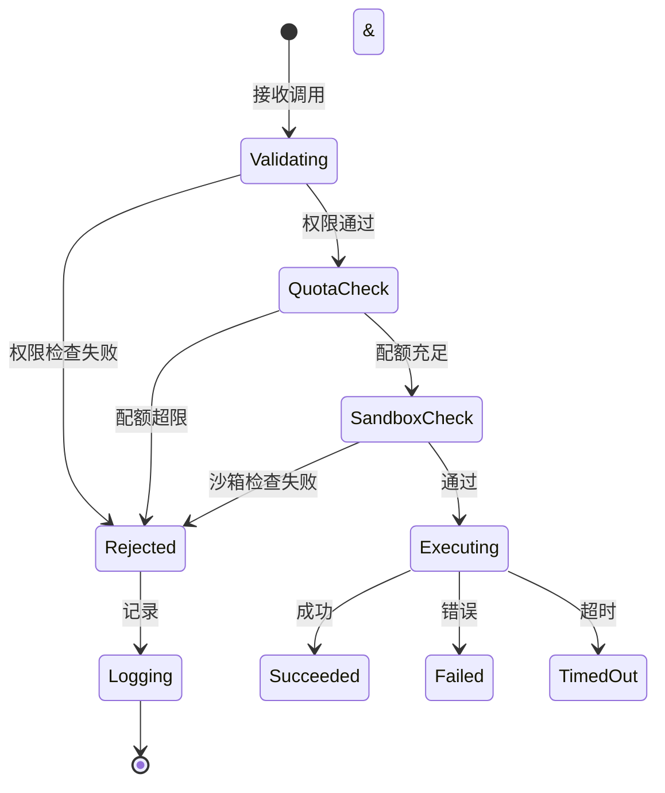

# Hermes Agent Java - 架构文档

> 系统整体架构、租户隔离机制与关键流程的核心视图。

---

## 一、整体系统架构

```mermaid
graph TB
    subgraph "External Layer"
        Users[用户/客户端]
        Platforms[消息平台<br/>Discord/Telegram/Feishu/QQ]
        ExternalAPIs[外部API<br/>OpenAI/Anthropic/Brave]
    end

    subgraph "Gateway Layer"
        Gateway[GatewayServer<br/>HTTP WebSocket]
        AuthFilter[TenantAuthFilter<br/>租户认证]
        RateLimiter[租户级限流]
    end

    subgraph "Core Engine"
        Agent[HermesAgentV2<br/>核心Agent引擎]
        ModelClient[ModelClient<br/>模型客户端]
        Transport[TransportFactory<br/>传输层适配]
    end

    subgraph "Tool System"
        ToolRegistry[ToolRegistry<br/>工具注册中心]
        subgraph "Built-in Tools"
            FileTool[FileTool]
            CodeTool[CodeTool]
            Browser[BrowserToolV2]
            WebSearch[WebSearchToolV2]
            Terminal[TerminalTool]
            GitTool[GitTool]
            MCPTool[MCPTool]
            SubAgent[SubAgentTool]
        end
        subgraph "Platform Tools"
            Feishu[FeishuDocTool]
            Discord[DiscordTool]
            QQBot[QQBotAdapter]
        end
    end

    subgraph "Multi-Tenant System"
        TenantMgr[TenantManager]
        TenantCtx[TenantContext]
        subgraph "Tenant Isolation"
            FileSandbox[文件沙箱]
            ProcessSandbox[进程沙箱]
            NetworkSandbox[网络沙箱]
            StorageQuota[存储配额]
            ThreadPool[线程池隔离]
        end
        subgraph "Tenant Management"
            Config[租户配置]
            Quota[资源配额]
            Security[安全策略]
            Audit[审计日志]
            SessionMgr[会话管理]
        end
    end

    subgraph "Storage Layer"
        LocalFS[本地文件系统<br/>sandbox/{tenantId}/]
        GitRepos[Git仓库]
    end

    Users -->|HTTP/WebSocket| Gateway
    Platforms -->|Webhook| Gateway
    Gateway --> AuthFilter --> RateLimiter --> Agent
    Agent --> ModelClient --> Transport --> ExternalAPIs
    Agent --> ToolRegistry
    ToolRegistry --> FileTool & CodeTool & Browser & WebSearch & Terminal & GitTool & MCPTool & SubAgent
    ToolRegistry --> Feishu & Discord & QQBot
    Agent --> TenantMgr --> TenantCtx
    TenantCtx --> FileSandbox & ProcessSandbox & NetworkSandbox & StorageQuota & ThreadPool
    TenantCtx --> Config & Quota & Security & Audit & SessionMgr
    FileSandbox --> LocalFS
    ProcessSandbox --> LocalFS
    Terminal --> LocalFS
    GitTool --> GitRepos
```

---

## 二、租户隔离架构

### 2.1 多层隔离模型



### 2.2 五大隔离维度

| 维度 | 组件 | 核心能力 |
|---|---|---|
| 文件 | TenantFileSandbox | 路径限制、权限控制、审计日志 |
| 进程 | ProcessSandbox | 命令白/黑名单、工作目录限制、环境变量清理、超时控制 |
| 网络 | NetworkSandbox | 域名白/黑名单、速率限制、请求审计 |
| 存储 | StorageQuotaEnforcer | 配额检查、流式写入追踪、阈值告警 |
| 线程 | TenantThreadPool | 线程数上限、队列限制、资源统计 |

---

## 三、关键流程时序

### 3.1 工具执行流程（带资源限制）



### 3.2 租户创建流程



---

## 四、组件关系

### 4.1 工具系统与租户隔离的集成



### 4.2 配置继承关系



配置优先级：**默认 < 租户 < 会话（运行时）**，高优先级覆盖低优先级。

---

## 五、部署架构



**最小部署形态（单机）：** JAR + systemd / Docker-compose + 文件存储 + SQLite 可选。

---

## 六、数据流

### 6.1 请求处理数据流



---

## 七、核心类关系



---

## 八、状态机

### 8.1 租户生命周期



### 8.2 工具执行状态机



执行路径上的每一次拒绝都进入审计日志。

---

## 九、持久化（Persistence）

Hermes Agent Java 使用分层持久化策略存储租户状态、会话、配额使用、轨迹和审计数据。

### 9.1 存储后端

`TenantStateRepository` 定义存储契约，已实现两种后端：

| 后端 | 实现类 | 适用场景 |
|---|---|---|
| PostgreSQL | `PostgresTenantRepository` | 生产环境、多节点部署 |
| 文件系统 | `FileSystemTenantRepository` | 本地开发、嵌入式部署、单节点 |

### 9.2 文件系统安全保障

文件系统后端采用两步数据安全链保护 JSON 状态文件：

1. **临时文件写入** → 先写 `*.tmp`
2. **原子替换** → 支持的文件系统用 `ATOMIC_MOVE`，否则 `REPLACE_EXISTING`
3. **备份保留** → 替换前复制旧版本到 `*.bak`
4. **备份恢复** → 加载时主文件缺失/损坏则回退到 `.bak`

目录布局：
```text
~/.hermes/persistence/
├── tenants/{tenantId}/
│   ├── state.json
│   └── state.json.bak
└── sessions/{tenantId}/
    ├── {sessionId}.json
    └── {sessionId}.json.bak
```

### 9.3 会话持久化

`SessionSerializer` / `JsonSessionSerializer` 序列化会话上下文，包含：session id、tenant id、node id、时间戳、metadata、active 标记、消息列表。

### 9.4 配额使用持久化

当前使用量：`~/.hermes/tenants/{tenantId}/state/usage.json`
历史归档（按天）：`~/.hermes/tenants/{tenantId}/state/history/YYYY-MM-DD.json`

### 9.5 轨迹持久化

```text
~/.hermes/trajectories/
├── trajectory_samples.jsonl
├── failed_trajectories.jsonl
├── compressed/{trajectoryId}.json
└── insights.jsonl
```

---

## 十、监控（Monitoring）

### 10.1 指标暴露

通过 `MetricsCollector` 和 `TenantMetrics` 以 Prometheus 文本格式暴露租户和系统指标。

**租户级指标：**
- 内存 used / max / usage percent
- 网络请求总数与被拦截数、QPS
- 活跃 Agent 数与会话数
- 存储使用量与配额、文件数
- 活跃进程数
- 近 1 小时审计事件数
- 配额告警/超限标记、租户状态

**告警投递指标：**
```text
hermes_alerts_fired_total
hermes_alerts_suppressed_total
hermes_alert_deliveries_succeeded_total
hermes_alert_deliveries_failed_total
hermes_alert_channel_deliveries_succeeded_total{channel="..."}
hermes_alert_channel_deliveries_failed_total{channel="..."}
```

### 10.2 告警通道

| 通道 | 实现类 | 说明 |
|---|---|---|
| Email | `EmailAlertChannel` | SMTP |
| Webhook | `WebhookAlertChannel` | 钉钉、飞书、Slack、Discord、通用 JSON |

配置通过环境变量：
```bash
export ALERT_WEBHOOK_URL="https://..."
export ALERT_EMAIL_SENDER="bot@example.com"
export ALERT_EMAIL_RECIPIENT="ops@example.com"
export ALERT_SMTP_HOST="smtp.example.com"
export ALERT_SMTP_PORT="465"
export ALERT_EMAIL_SSL="true"
```

### 10.3 告警冷却

每个 `tenant:type` 有 5 分钟冷却，防止告警风暴。被抑制的告警计入 `hermes_alerts_suppressed_total`。

### 10.4 建议的 Prometheus 告警规则

```yaml
groups:
  - name: hermes
    rules:
      - alert: HermesTenantMemoryHigh
        expr: hermes_tenant_memory_usage_percent > 0.8
        for: 5m
        labels: { severity: warning }

      - alert: HermesAlertDeliveryFailing
        expr: increase(hermes_alert_deliveries_failed_total[10m]) > 0
        for: 1m
        labels: { severity: warning }
```

---

## 十一、Gateway 服务模式

Hermes Gateway 支持轻量级服务模式，基于 PID 文件管理进程。

### 11.1 PID 文件

默认位置：`~/.hermes/gateway.pid`，用于检测是否已有网关进程运行，以及后续停止服务。

### 11.2 启动与停止

```bash
# 启动（前台运行，记录 PID）
java -jar target/hermes-agent-java-*.jar gateway start

# 停止（读取 PID 发终止信号，超时强制销毁）
java -jar target/hermes-agent-java-*.jar gateway stop
```

### 11.3 生产部署建议

生产环境建议使用 systemd / Docker / Kubernetes 等进程管理器。服务模式提供 PID 记账，但本身不是完整的守护进程监督器。

**systemd 示例：**
```ini
[Unit]
Description=Hermes Agent Java Gateway
After=network.target

[Service]
Type=simple
User=hermes
WorkingDirectory=/opt/hermes-agent-java
ExecStart=/usr/bin/java -jar hermes-agent-java.jar gateway start
ExecStop=/usr/bin/java -jar hermes-agent-java.jar gateway stop
Restart=on-failure
RestartSec=5

[Install]
WantedBy=multi-user.target
```

**行为说明：**
- JVM 正常退出时 PID 文件自动移除
- 进程被异常杀死时，下次启动检测 PID 是否存活，自动清理陈旧文件
- 网关优雅关闭时会停止适配器、API 服务、Dashboard 和租户管理器

---

*版本: v1.2（含持久化、监控、Gateway）*
