# 🔌 Hermes Java Plugin Development Guide

> 给外部开发者：如何为 Hermes Agent Java 编写一个插件。

本指南假设你已熟悉 Java + Maven。读完后你能：

- 写出一个最小可运行的插件
- 知道如何注册工具、平台适配器、Provider、钩子
- 把插件打包成 jar 并部署到 `~/.hermes/plugins/`

---

## 🚀 5 分钟快速开始

```bash
# 1. 创建插件目录
mkdir -p my-plugin && cd my-plugin

# 2. 准备 pom.xml + 源码（见下文）
# 3. 打包
mvn package

# 4. 部署
mkdir -p ~/.hermes/plugins/my-plugin
cp target/my-plugin.jar ~/.hermes/plugins/my-plugin/
cp plugin.yaml          ~/.hermes/plugins/my-plugin/

# 5. 启用
cat >> ~/.hermes/config.yaml <<EOF
plugins:
  enabled:
    - my-plugin
EOF

# 6. 重启 Hermes，看日志
```

---

## 🏗️ 插件系统总览

```mermaid
graph LR
    A[plugin.yaml] -->|声明元数据| B[PluginManager]
    C[your-plugin.jar] -->|提供实现| B
    B -->|register&#40;ctx&#41;| D[PluginContext]
    D --> E[ToolRegistry]
    D --> F[PlatformRegistry]
    D --> G[ProviderRegistry]
    D --> H[HookEngine]
```



| 组件 | 作用 |
|------|------|
| `plugin.yaml` | 插件清单：name / kind / 依赖环境变量 |
| `Plugin` 接口 | 插件入口，只有一个 `register(ctx)` 方法 |
| `PluginContext` | 受控门面，插件通过它注册一切 |
| `PluginManager` | 发现 → 加载 → 调用 register |

---

## 📦 插件目录结构

```
~/.hermes/plugins/
└── my-plugin/                      ← 插件根目录
    ├── plugin.yaml                 ← 必需：元数据
    ├── plugin.properties           ← 可选：main-class hint
    ├── my-plugin.jar               ← 必需：实现 jar
    └── lib/                        ← 可选：依赖 jar 目录
        └── third-party-dep.jar
```

也支持 **Category 布局**（同类后端聚合）：

```
plugins/
└── image_gen/
    ├── openai/
    │   ├── plugin.yaml
    │   └── openai-backend.jar
    └── stability/
        ├── plugin.yaml
        └── stability-backend.jar
```

---

## 📜 plugin.yaml 清单

```yaml
name: my-plugin                     # 必填：插件逻辑名（唯一）
label: My Plugin                    # 显示名
kind: standalone                    # 见下表
version: 1.0.0
description: >
  示例插件，提供 hello_world 工具。
author: Your Name

# 声明插件需要的环境变量（setup 向导用）
requires_env:
  - name: MY_PLUGIN_API_KEY
    description: "API key for the third-party service"
    prompt: "Enter your API key"
    password: true                  # 输入时隐藏

optional_env:
  - name: MY_PLUGIN_REGION
    description: "Default region"

# 插件提供的能力（声明用，不强制校验）
provides_tools:
  - hello_world
provides_hooks:
  - pre_tool_call
```

### `kind` 字段

| 值 | 加载行为 | 适用场景 |
|----|----------|----------|
| `standalone` | **opt-in**（需 `plugins.enabled` 列出）| 独立功能插件，自带工具/钩子 |
| `backend` | **bundled 自动加载，user opt-in** | 某类后端的实现（image_gen、tts 等）|
| `platform` | **bundled 自动加载** | 消息平台适配器（Feishu/Discord 等）|
| `exclusive` | **跳过**（专属系统处理）| 内存 / 上下文引擎等单实例类别 |
| `model-provider` | **跳过**（providers 子系统处理）| LLM 模型 Provider |

> **opt-in 默认安全**：用户/项目插件必须在 `~/.hermes/config.yaml` 的 `plugins.enabled` 中显式列出才会加载。

---

## ✏️ Plugin 入口契约

```java
package com.example.myplugin;

import com.nousresearch.hermes.plugin.Plugin;
import com.nousresearch.hermes.plugin.context.PluginContext;

public class MyPlugin implements Plugin {
    @Override
    public void register(PluginContext ctx) {
        // 在这里注册一切：工具、钩子、平台、Provider...
    }
}
```

### 三种入口点发现方式（按优先级）

| 优先级 | 机制 | 配置 |
|--------|------|------|
| 1 | Java SPI | `META-INF/services/com.nousresearch.hermes.plugin.Plugin` 文件，内容为类全名 |
| 2 | `plugin.properties` | `main-class=com.example.myplugin.MyPlugin` |
| 3 | JAR Manifest | `Plugin-Class: com.example.myplugin.MyPlugin` |

任选其一即可。**推荐 SPI**（标准、零配置文件）。

---

## 🛠️ 注册工具（最常见场景）

```java
public void register(PluginContext ctx) {
    Map<String, Object> schema = Map.of(
        "description", "Say hello to someone",
        "parameters", Map.of(
            "type", "object",
            "properties", Map.of(
                "name", Map.of("type", "string", "description", "Person's name")
            ),
            "required", List.of("name")
        )
    );

    ctx.registerTool(
        "hello_world",                  // 工具名
        "demo",                         // toolset 分组
        schema,                         // JSON Schema
        args -> {                       // 处理器
            String name = (String) args.get("name");
            return "{\"greeting\":\"Hello, " + name + "!\"}";
        },
        "Say hello to someone",         // 描述
        "👋",                            // emoji
        false                           // override：是否覆盖同名内置工具
    );
}
```

工具调用结果应返回 **JSON 字符串**。建议用 `com.fasterxml.jackson.databind.ObjectMapper` 序列化。

---

## 🪝 注册钩子（生命周期回调）

```java
import com.nousresearch.hermes.plugin.hook.HookType;

ctx.registerHook(HookType.PRE_TOOL_CALL, context -> {
    String toolName = (String) context.get("tool_name");
    Map<String, Object> args = (Map<String, Object>) context.get("args");

    // 拦截某个工具
    if ("dangerous_tool".equals(toolName)) {
        return Map.of(
            "action", "block",
            "message", "Blocked by my-plugin policy"
        );
    }
    return null;  // 允许执行
});

ctx.registerHook(HookType.POST_LLM_CALL, context -> {
    // 观察 LLM 调用，用于审计/统计
    log.info("LLM called for session {}", context.get("session_id"));
    return null;
});
```

### 17 种钩子速查

| 钩子 | 触发时机 | 返回值语义 |
|------|----------|------------|
| `PRE_TOOL_CALL` | 工具执行前 | `{action: block, message}` 拦截 |
| `POST_TOOL_CALL` | 工具执行后 | 观察用，返回值忽略 |
| `TRANSFORM_TOOL_RESULT` | 工具结果返回前 | 返回 String 替换结果 |
| `PRE_LLM_CALL` | LLM 调用前 | 返回 String 作为 system 消息注入 |
| `POST_LLM_CALL` | LLM 响应后 | 观察用 |
| `TRANSFORM_LLM_OUTPUT` | 最终输出前 | 返回 String 替换输出 |
| `PRE_GATEWAY_DISPATCH` | 网关消息分发前 | `{action: skip\|rewrite}` |
| `ON_SESSION_START/END/RESET` | 会话生命周期 | 观察用 |
| `PRE/POST_API_REQUEST` | API 请求前后 | 观察 / 修改 |
| `PRE_APPROVAL_REQUEST` | 审批请求前 | 观察 |
| `POST_APPROVAL_RESPONSE` | 审批响应后 | 观察 |
| `SUBAGENT_STOP` | 子 Agent 停止 | 观察 |
| `TRANSFORM_TERMINAL_OUTPUT` | 终端输出前 | 返回 String 替换 |

> ⚠️ 钩子回调抛异常会被捕获并记录日志，**不会**中断核心循环。

---

## 🌐 注册平台适配器

```java
import com.nousresearch.hermes.plugin.registry.PlatformEntry;
import com.nousresearch.hermes.gateway.PlatformAdapter;

ctx.registerPlatform(PlatformEntry.builder("slack", "Slack")
    .adapterFactory(config -> new MySlackAdapter())
    .checkFn(() -> System.getenv("SLACK_BOT_TOKEN") != null)
    .validateConfig(cfg -> true)
    .requiredEnv(List.of("SLACK_BOT_TOKEN"))
    .installHint("Set SLACK_BOT_TOKEN environment variable")
    .source("plugin")
    .pluginName(ctx.getPluginName())
    .emoji("💼")
    .platformHint("You are on Slack. Use mrkdwn format.")
    .cronDeliverEnvVar("SLACK_HOME_CHANNEL")
    .build());
```

`MySlackAdapter` 需实现 `com.nousresearch.hermes.gateway.PlatformAdapter` 接口。

---

## 🎨 注册 Provider（后端实现）

适用于：图像生成、TTS、Web 搜索等"有多个备选后端"的能力。

```java
import com.nousresearch.hermes.tools.provider.ImageGenProvider;

public class MyMidjourneyProvider implements ImageGenProvider {
    @Override public String getName() { return "midjourney"; }
    @Override public boolean isAvailable() {
        return System.getenv("MJ_API_KEY") != null;
    }
    @Override public byte[] generate(String prompt, String size, String quality,
                                     Map<String,Object> opts) throws Exception {
        // 调用 Midjourney API ...
        return imageBytes;
    }
    @Override public byte[] edit(String imagePath, String prompt, String maskPath,
                                 Map<String,Object> opts) throws Exception {
        throw new UnsupportedOperationException();
    }
}

// 注册
ctx.registerProvider("image_gen", new MyMidjourneyProvider());
```

### 内置 Provider 类别

| 类别 | 接口 |
|------|------|
| `web_search` | `com.nousresearch.hermes.tools.impl.web.WebSearchBackend` |
| `image_gen` | `com.nousresearch.hermes.tools.provider.ImageGenProvider` |
| `tts` | `com.nousresearch.hermes.tools.provider.TTSProvider` |

> ⚠️ **内置优先**：注册表会拒绝插件覆盖同名的内置 Provider（防止恶意替换）。

---

## 📦 完整示例：Hello World 插件

### 目录结构

```
hello-world-plugin/
├── pom.xml
├── plugin.yaml
└── src/main/
    ├── java/com/example/HelloPlugin.java
    └── resources/META-INF/services/
        └── com.nousresearch.hermes.plugin.Plugin
```

### `pom.xml`

```xml
<project xmlns="http://maven.apache.org/POM/4.0.0">
    <modelVersion>4.0.0</modelVersion>
    <groupId>com.example</groupId>
    <artifactId>hello-world-plugin</artifactId>
    <version>1.0.0</version>
    <packaging>jar</packaging>

    <properties>
        <maven.compiler.source>21</maven.compiler.source>
        <maven.compiler.target>21</maven.compiler.target>
    </properties>

    <dependencies>
        <!-- Hermes plugin SPI - provided by host at runtime -->
        <dependency>
            <groupId>com.nousresearch</groupId>
            <artifactId>hermes-agent-java</artifactId>
            <version>1.0.0</version>
            <scope>provided</scope>
        </dependency>
    </dependencies>
</project>
```

### `plugin.yaml`

```yaml
name: hello-world
label: Hello World
kind: standalone
version: 1.0.0
description: A minimal example plugin
author: Your Name
provides_tools:
  - hello_world
```

### `HelloPlugin.java`

```java
package com.example;

import com.nousresearch.hermes.plugin.Plugin;
import com.nousresearch.hermes.plugin.context.PluginContext;
import com.nousresearch.hermes.plugin.hook.HookType;

import java.util.List;
import java.util.Map;

public class HelloPlugin implements Plugin {
    @Override
    public void register(PluginContext ctx) {
        // 注册一个 hello_world 工具
        ctx.registerTool(
            "hello_world",
            "demo",
            Map.of(
                "description", "Greet someone",
                "parameters", Map.of(
                    "type", "object",
                    "properties", Map.of(
                        "name", Map.of("type", "string")
                    ),
                    "required", List.of("name")
                )
            ),
            args -> {
                String name = (String) args.getOrDefault("name", "World");
                return "{\"greeting\":\"Hello, " + name + "!\"}";
            },
            "Greet someone by name",
            "👋",
            false
        );

        // 注册一个简单的钩子：所有工具调用都记日志
        ctx.registerHook(HookType.POST_TOOL_CALL, context -> {
            System.out.println("[hello-plugin] tool called: " + context.get("tool_name"));
            return null;
        });
    }
}
```

### `META-INF/services/com.nousresearch.hermes.plugin.Plugin`

```
com.example.HelloPlugin
```

### 打包与部署

```bash
mvn package

mkdir -p ~/.hermes/plugins/hello-world
cp target/hello-world-plugin-1.0.0.jar ~/.hermes/plugins/hello-world/
cp plugin.yaml ~/.hermes/plugins/hello-world/

# 启用
echo "plugins:
  enabled:
    - hello-world" >> ~/.hermes/config.yaml

# 重启 Hermes
```

启动日志应看到：

```
Loaded plugin via ServiceLoader: com.example.HelloPlugin (hello-world)
Tool registered: hello_world (toolset=demo, override=false)
```

---

## 🧰 进阶：依赖管理

### 插件依赖第三方库

把依赖 jar 放到 `<plugin-dir>/lib/`：

```
~/.hermes/plugins/hello-world/
├── plugin.yaml
├── hello-world-plugin.jar
└── lib/
    ├── okhttp-4.12.0.jar
    └── jackson-databind-2.16.0.jar
```

`JarPluginLoader` 会自动加载 `lib/` 下所有 jar 到插件的隔离 ClassLoader。

### 类加载隔离

每个外部插件用独立 `URLClassLoader`，依赖**不会**污染主 classpath。这意味着：

- 你的插件可以用与 Hermes 不同版本的 Jackson / OkHttp
- 但**不要**在插件 jar 中包含 `com.nousresearch.hermes.*` 类（会被主类加载器优先解析）

---

## 🧪 测试你的插件

### 单元测试

```java
@Test
void testPluginRegisters() {
    HermesConfig config = HermesConfig.load();
    PluginManager pm = new PluginManager(config);

    HelloPlugin plugin = new HelloPlugin();
    PluginContextImpl ctx = new PluginContextImpl(
        new PluginManifest("hello-world", ..., PluginKind.STANDALONE, "hello-world"),
        pm
    );
    plugin.register(ctx);

    // 验证工具注册成功
    assertNotNull(ToolRegistry.getInstance().getSchema("hello_world"));
}
```

### 集成测试

1. `mvn package`
2. 部署到 `~/.hermes/plugins/hello-world/`
3. 启动 Hermes
4. 通过 Dashboard 或 CLI 调用 `hello_world` 工具

---

## 🔒 安全与最佳实践

### ✅ Do

- **声明 `requires_env`** — 让 Hermes 在配置缺失时给出友好提示
- **钩子回调要快** — 不要在 hook 中做长耗时操作，可异步派发
- **返回 JSON 字符串** — 工具结果应是结构化 JSON
- **使用 `ctx.getLlm()`** — 复用宿主的 LLM 配置，不要自带 API Key
- **加日志** — 用 SLF4J，方便用户调试
- **写 README** — 在插件目录加 `README.md` 说明用法

### ❌ Don't

- 不要在 `register()` 里启动长任务 — 该方法应快速返回
- 不要捕获并吞掉所有异常 — 让 PluginManager 记录
- 不要修改 Hermes 内部状态 — 只通过 `PluginContext` 注册
- 不要在工具结果里写敏感数据（API Key、密码等）
- 不要在 hook 中频繁调用 LLM — 会导致循环放大

---

## 🐛 排查

### 插件没加载？

检查启动日志：

```
Plugin discovery complete: N found, M enabled
```

| 现象 | 原因 |
|------|------|
| `Skipping 'xxx' (not enabled in config)` | 没在 `plugins.enabled` 中列出 |
| `Skipping 'xxx' (disabled via config)` | 被 `plugins.disabled` 显式禁用 |
| `No Plugin implementation found for xxx` | 缺少 SPI 文件或 main-class 配置 |
| `Failed to load plugin xxx: ...` | 看后面的异常栈 |

### 启用调试日志

```yaml
# ~/.hermes/config.yaml
logging:
  level:
    com.nousresearch.hermes.plugin: DEBUG
```

---

## 📚 参考

| 文档 | 说明 |
|------|------|
| [PLUGIN_ARCHITECTURE.md](PLUGIN_ARCHITECTURE.md) | 插件系统架构与设计原理 |
| [ARCHITECTURE.md](ARCHITECTURE.md) | Hermes 整体架构 |
| [API.md](API.md) | HTTP/WebSocket API |
| Hermes 源码 | `src/main/java/com/nousresearch/hermes/plugin/builtin/` 下的内置插件示例 |

---

## 🎁 内置插件参考

这些内置插件是最好的示例，照着写就行：

| 插件 | 类型 | 路径 |
|------|------|------|
| Feishu Platform | platform | `plugin/builtin/feishu/FeishuPlatformPlugin.java` |
| Telegram Platform | platform | `plugin/builtin/telegram/TelegramPlatformPlugin.java` |
| Discord Platform | platform | `plugin/builtin/discord/DiscordPlatformPlugin.java` |
| QQBot Platform | platform | `plugin/builtin/qqbot/QQBotPlatformPlugin.java` |
| WeCom Platform | platform | `plugin/builtin/wecom/WeComPlatformPlugin.java` |

---

## 🤝 发布你的插件

完成后，建议：

1. 在 GitHub 开源（让别人能找到）
2. 加 README + LICENSE
3. 提交到 [Hermes Plugin Hub](https://github.com/nousresearch/hermes-plugins)（如有）

---

> 💡 有问题？在 [GitHub Issues](https://github.com/nousresearch/hermes-agent-java/issues) 开个 issue，或加入 Discord 社区讨论。
